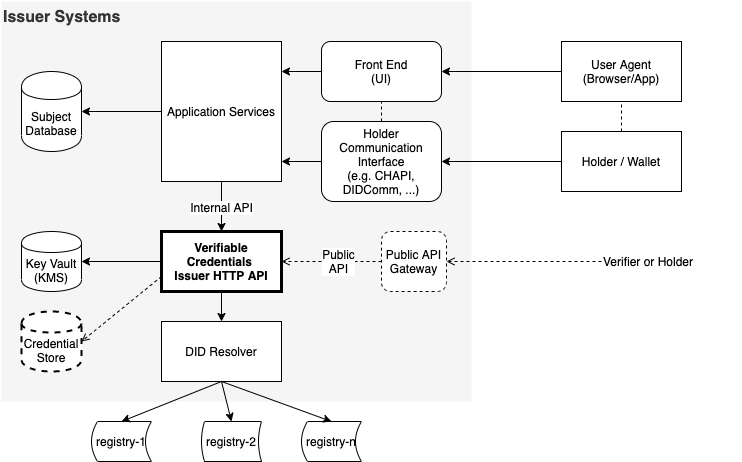

#  Verifiable Credential Issuer HTTP API Architecture Model
This document describes the architecture model and context for the Verifiable
Credential Issuer HTTP API.

## Overview
The Verifiable Credential Issuer HTTP API is designed to be a consistent API for
Issuer Services to call in order to generate Verifiable Credentials. This API is
intended for Issuer Services who are able to manage and secure external
connections to Holders. This API encapsulates and abstracts the Verifiable
Credential data model, format, and proof methods from Issuer Services. This API
also abstracts any underlying DID methods, resolver capabilities, and
cryptographic algorithms from the Issuer Services.

## Objectives
The following capture the objectives of this API.
1. Provide an open and consistent HTTP based API for Issuer Services to leverage
when generating Verifiable Credentials.
1. Abstract the underlying data model, formats and proof mechanisms from the
Issuer Services.
1. Abstract the underlying DID methods and cryptographic algorithms from the
Issuer Services as required.
1. Rely on 'upstream' Issuer Services to manage connections with external
entities (like Holder software).

These objectives allow for Issuer Services to modify their underlying Verifiable
Credential, supported DID methods, and cryptographic suites software with
minimal impact to their application services, business logic and user experience.  

## Component Overview
The following diagram is a high level, generic overview of the intended
architecture context for this API.

### Components
#### 1. User Agent
This is the software the user (or individual) is using to interact with the
Issuer Service. This could be a web browser, a mobile App, a Kiosk, etc...

#### 2. Holder / Wallet
This is the software that is able to request/store/manage the user's DIDs,
Verifiable Credentials, cryptographic keys, and so on. Examples include cloud
agents, mobile Apps, web browser apps, or a combination thereof. Holders may
make use of other software components not shown.    

#### 3. Issuer Front End Services
The Issuer service that renders to the user's agent, helping them obtain the
credential and navigate the Issuer business logic.

#### 4. Issuer-to-Holder Communication Interface
The abstract interface for the Issuer and Holder to communicate to authenticate,
exchange, and manage DIDs and Verifiable Credentials. Issuer Services are
responsible for establishing a secure communication channel with the user's
Holder. Examples include CHAPI, DIDComm, possibly a proximity wireless channel, a physical/visual barcode
scanner, etc... . In certain deployments the communication interface is tightly
coupled to the user interface, and in other scenarios this is managed through
cloud agents.  

#### 5. Issuer Application Services
The Issuer collection of middleware / micro services / application servers that
make up the Issuer Service.

#### 6. Issuer Subject Database
The database containing the Subject data the Issuer will use to generate Verifiable
Credentials.

#### 7. Verifiable Credential Issuer HTTP API Service
An implementation of the Verifiable Credentials Issuer HTTP API (this spec) that
is capable of generating Verifiable Credentials in accordance with the Issuer's
policies and approved technologies (including cryptographic methods and data
formats).

#### 8. Issuer Key Vault
A supporting cryptographic key manager service for the Issuer to protect private
keys and secrets associated with generating Verifiable Credentials (for example,
the Issuer DID private key).

#### 9. Credential Store (optional?)
A repository of previously Issued credentials and/or credential identifiers
(and their current status?)

#### 10. DID Resolver
This architecture assumes the use of DIDs and Verifiable Credentials. The
Verifiable Credential Issuer HTTP API Service will connect to a DID Resolver to
resolve Holder DIDs to their associated DID Documents.

#### 11. Public API Gateway (optional?)
If the Issuer supports external services querying issued Credential status,
access is controlled through a public API gateway. Securing inbound connections
is the job of this component and outside the scope of this specification.

#### 12. Verifiers and Holders (optional?)
External entities capable of querying credential status.

## API Security
The method for securing the Internal and Public API interfaces from unauthorized
access is currently not defined as part of the API. The Issuer Service is
required to define and implement this security in accordance with their internal
requirements. Recommendations include OAuth 2.0 Client Credentials, mutual TLS,
DIDComm.     

## Limitations and Considerations
The current architecture assumes the use of DIDs in the Verifiable Credentials
for establishing key exchange.

As mentioned above, securing the API endpoints is a requirement of the Issuer
Service.

The Key Vault, Credential Store, and DID Resolver may be provided as part of
the Issuer API implementation or supplied by the Issuer Service (this is
implementation specific).

*There may be a limitation for Credential proof formats that require a bi-lateral
communication channel for establishing or exchanging cryptographic materials!* This
is not the intention of the specification, and input from the community on how
to resolve any such issues would be appreciated.

## References
* Decentralized Identifiers specification
* Verifiable Credentials Data Model specification
* CHAPI
* DIDComm
